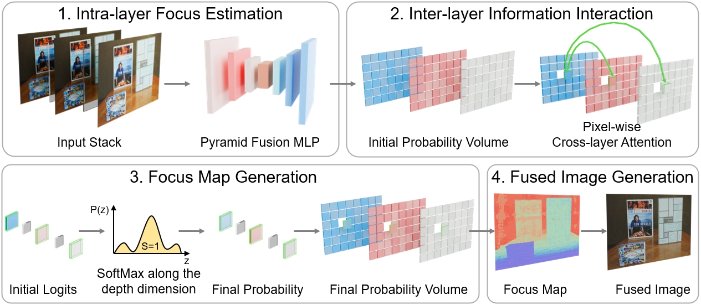

<div align="center">

#  StackMFF V3

**General Multi-focus Image Fusion Network**

[](https://opensource.org/licenses/MIT)
[](https://www.python.org/)
[](https://pytorch.org/)
[](https://github.com/Xinzhe99/StackMFF-V3)

*Official PyTorch implementation for General Multi-focus Image Fusion Network*

</div>

## 📢 News

> [!NOTE]
> 🎉 **2025.10**: Our StackMFF V3 paper is about to be submitted, and the complete code will be uploaded after acceptance.

</div>

##  Table of Contents

- [Overview](#-overview)
- [Highlights](#-highlights)
- [Installation](#-installation)
- [Data Preparation](#-data-preparation)
- [Downloads](#-downloads)
- [Usage](#-usage)
- [Citation](#-citation)

## 📖 Overview

<div align="center">

<p>Overview of StackMFF-V3 Framework</p>
</div>

## ✨ Highlights

- Presents the first general multi-focus image fusion network.
- Reformulates stack fusion as a pixel-wise multi-class classification task.
- Employs an MLP-based backbone for intra-layer focus estimation with global context.
- Proposes a Pixel-wise Cross-layer Attention module for inter-layer modeling.
- Provides an open-source solution that outperforms commercial software at low cost.

 
## 🚀 Installation

1. Clone the repository:
```bash
git clone https://github.com/Xinzhe99/StackMFF-V3.git
cd StackMFF-V3
```

2. Create and activate a virtual environment (recommended):
```bash
conda create -n stackmffv3 python=3.8
conda activate stackmffv3
```

3. Install dependencies:
```bash
pip install -r requirements.txt
```

## 📖 Data Preparation

We provide the test datasets used in our paper for research purposes. These datasets were used to evaluate the performance of our proposed method and compare with other state-of-the-art approaches:
- Mobile_Depth
- Middlebury
- FlyingThings3D
- Road-MF

## 📥 Downloads

| Resource | Link | Code | Description |
|----------|------|------|-------------|
| 🗂️ **Test Datasets** | [](https://pan.baidu.com/s/1XrKGlqSK6kc_R-1AzprHlA?pwd=cite) | `cite` | Complete test datasets |
| 📊 **Benchmark Results** | [](https://pan.baidu.com/s/1_rBtM9o7RUQP4oyt8HHXwg?pwd=cite) | `cite` | Fusion results from all methods |


## 💻 Usage

The pre-trained model weights files (`stackmffv3.pth` and `stackmffv3_star.pth`) should be placed in the [weights](https://github.com/Xinzhe99/StackMFF-V3/tree/main/weights) directory.

### Examples for fusing an image stack

To fuse a stack of multi-focus images, organize your input images in a folder with numeric filenames (e.g., `0.png`, `1.png`, etc.):

```
input_stack/
├── 0.png
├── 1.png
├── 2.png
└── 3.png
```

Run the StackMFF V3 prediction script:

```bash
python predict_one_stack.py --input_dir ./input_stack --output_dir ./results
```

Run the StackMFF V3-star prediction script:

```bash
python predict_one_stack_star.py --input_dir ./input_stack --output_dir ./results_star
```
### Example of batch processing test dataset

To perform batch processing on multiple test datasets, organize your data in the following directory structure:

```
test_datasets/
├── Mobile Depth/
│   └── dof_stack/
│       ├── scene1/
│       │   ├── 0.png
│       │   ├── 1.png
│       │   └── 2.png
│       └── scene2/
│           ├── 0.png
│           ├── 1.png
│           └── 2.png
├── FlyingThings3D/
│   └── dof_stack/
└── Middlebury/
    └── dof_stack/
```

Run the StackMFF V3 prediction script:

```bash
python predict_datasets.py --test_root ./test_datasets --output_dir ./bench_results
```

Run the StackMFF V3-star prediction script:

```bash
python predict_datasets_star.py --test_root ./test_datasets --output_dir ./bench_results_star
```

Example with custom parameters:

```bash
python predict_datasets.py --test_root ./test_datasets --output_dir ./bench_results --test_datasets "Mobile Depth" "FlyingThings3D" "Middlebury" "Road-MF"
```

## 📚 Citation

If you use this project in your research, please cite our papers:

<details>
<summary>📋 BibTeX</summary>

```bibtex
@article{xie2025stackmffv2,
title = {One-shot multi-focus image stack fusion via focal depth regression},
journal = {Engineering Applications of Artificial Intelligence},
volume = {162},
pages = {112667},
year = {2025},
issn = {0952-1976},
doi = {https://doi.org/10.1016/j.engappai.2025.112667},
url = {https://www.sciencedirect.com/science/article/pii/S0952197625026983},
author = {Xinzhe Xie and Buyu Guo and Shuangyan He and Yanzhen Gu and Yanjun Li and Peiliang Li},
keywords = {Multi-focus image fusion, Focus measure, Computational photography, Image stack processing},
abstract = {Multi-focus image fusion is a vital computational imaging technique for applications that require an extended depth of field, including medical imaging, microscopy, professional photography, and autonomous driving. While existing methods excel at fusing image pairs, they often suffer from error accumulation that leads to quality degradation, as well as computational inefficiency when applied to large image stacks. To address these challenges, we introduce a one-shot fusion framework that reframes image-stack fusion as a focal-plane depth regression problem. The framework comprises three key stages: intra-layer focus estimation, inter-layer focus estimation, and focus map regression. By employing a differentiable soft regression strategy and using depth maps as proxy supervisory signals, our method enables end-to-end training without requiring manual focus map annotations. Comprehensive experiments on five public datasets demonstrate that our approach achieves state-of-the-art performance with minimal computational overhead. The resulting efficiency and scalability make the proposed framework a compelling solution for real-time deployment in resource-constrained environments and lay the groundwork for broader practical adoption of multi-focus image fusion. The code is available at https://github.com/Xinzhe99/StackMFF-V2.}
}
@article{xie2025stackmff,
  title={StackMFF: end-to-end multi-focus image stack fusion network},
  author={Xie, Xinzhe and Qingyan, Jiang and Chen, Dong and Guo, Buyu and Li, Peiliang and Zhou, Sangjun},
  journal={Applied Intelligence},
  volume={55},
  number={6},
  pages={503},
  year={2025},
  publisher={Springer}
}
```

</details>

## 🙏 Acknowledgments

TBD.

⭐ If you find this project helpful, please give it a star!

</div>


