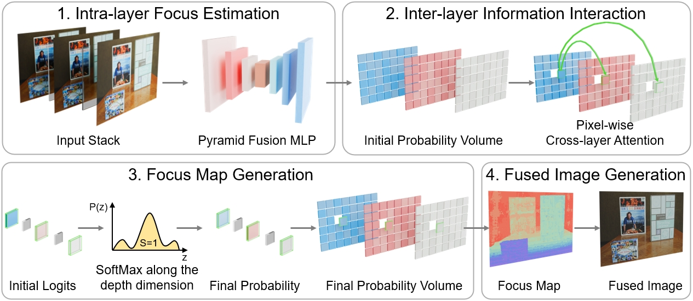

<div align="center">

#  StackMFF V3

**General Multi-focus Image Fusion Network**

[](https://opensource.org/licenses/MIT)
[](https://www.python.org/)
[](https://pytorch.org/)
[](https://github.com/Xinzhe99/StackMFF-V3)

*Official PyTorch implementation for General Multi-focus Image Fusion Network*

</div>

## 📢 News

> [!NOTE]
> 🎉 **2025.10**: The paper for StackMFF V3 has been submitted. The preprint will be released soon, and the complete code, including the training part, will be uploaded after acceptance.

## Table of Contents

- [Overview](#-overview)
- [Highlights](#-highlights)
- [Installation](#-installation)
- [Downloads](#-downloads)
- [Usage](#-usage)
- [Citation](#-citation)

## 📖 Overview

<div align="center">

</div>

## ✨ Highlights

- Presents the first general multi-focus image fusion network.
- Reformulates stack fusion as a pixel-wise multi-class classification task.
- Employs an MLP-based backbone for intra-layer focus estimation with global context.
- Proposes a Pixel-wise Cross-layer Attention module for inter-layer modeling.
- Provides an open-source solution that outperforms commercial software at low cost.

 
## 🚀 Installation

1. Clone the repository:
```bash
git clone https://github.com/Xinzhe99/StackMFF-V3.git
cd StackMFF-V3
```

2. Create and activate a virtual environment (recommended):
```bash
conda create -n stackmffv3 python=3.8
conda activate stackmffv3
```

3. Install dependencies:
```bash
pip install -r requirements.txt
```

## 📥 Downloads

| Resource | Link | Code | Description |
|----------|------|------|-------------|
| 🗂️ **Test Datasets** | [](https://pan.baidu.com/s/1XrKGlqSK6kc_R-1AzprHlA?pwd=cite) | `cite` | Complete test datasets |
| 📊 **Benchmark Results** | [](https://pan.baidu.com/s/1_rBtM9o7RUQP4oyt8HHXwg?pwd=cite) | `cite` | Fusion results from all methods |


## 💻 Usage

The pre-trained model weights files (`stackmffv3.pth` and `stackmffv3_star.pth`) should be placed in the [weights](https://github.com/Xinzhe99/StackMFF-V3/tree/main/weights) directory.

### Example for fusing an image stack

To fuse a stack of multi-focus images, organize your input images in a folder with numeric filenames (e.g., `0.png`, `1.png`, etc.):

```
input_stack/
├── 0.png
├── 1.png
├── 2.png
└── 3.png
```

Run the StackMFF V3 prediction script:

```bash
python predict_one_stack.py --input_dir ./input_stack --output_dir ./results
```

Run the StackMFF V3-star prediction script:

```bash
python predict_one_stack_star.py --input_dir ./input_stack --output_dir ./results_star
```
### Example of batch processing test datasets

To perform batch processing on multiple test datasets, organize your data in the following directory structure:

```
test_datasets/
├── Mobile Depth/
│   └── image stack/
│       ├── scene1/
│       │   ├── 0.png
│       │   ├── 1.png
│       │   └── 2.png
│       └── scene2/
│           ├── 0.png
│           ├── 1.png
│           └── 2.png
├── FlyingThings3D/
│   └── image stack/
└── Middlebury/
    └── image stack/
```

Run the StackMFF V3 prediction script:

```bash
python predict_datasets.py --test_root ./test_datasets --output_dir ./bench_results
```

Run the StackMFF V3-star prediction script:

```bash
python predict_datasets_star.py --test_root ./test_datasets --output_dir ./bench_results_star
```
### Example of fusing image pairs from datasets

To fuse image pairs from multiple datasets, organize your data in the following directory structure:

```
image_pair_datasets/
├── Lytro/
│   ├── A/
│   │   ├── 1.png
│   │   ├── 2.png
│   │   └── 3.png
│   └── B/
│       ├── 1.png
│       ├── 2.png
│       └── 3.png
├── MFFW/
│   ├── A/
│   └── B/
└── MFI-WHU/
    ├── A/
    └── B/
```

Run the StackMFF V3 image pair prediction script:

```bash
python predict_pair_datasets.py --test_root ./image_pair_datasets --output_dir ./pair_results
```

Run the StackMFF V3-star image pair prediction script:

```bash
python predict_pair_datasets_star.py --test_root ./image_pair_datasets --output_dir ./pair_results_star
```

## 📚 Citation

If you use this project in your research, please cite our papers:

TBD.

## 🙏 Acknowledgments

TBD.

⭐ If you find this project helpful, please give it a star!


